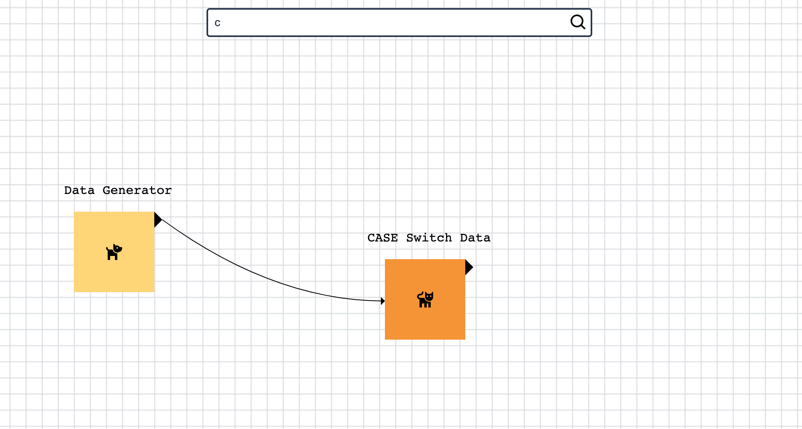

Click here to see the [DEMO](https://lime-lac.vercel.app/)!


## Description

Technologies used to build this project:

-   [Next.js](https://nextjs.org/) - as a base framework to build the app.
-   [Typescript](https://www.typescriptlang.org/) - To have types in JS.
-   [Canvas API](https://developer.mozilla.org/en-US/docs/Web/API/Canvas_API) - Browser canvas APi.

## Getting Started

First, install all dependencies:

```bash
npm install
# or
yarn
```

Then, run the development server:

```bash
npm run dev
# or
yarn dev
```

Open [http://localhost:3000](http://localhost:3000) with your browser to see the result.
